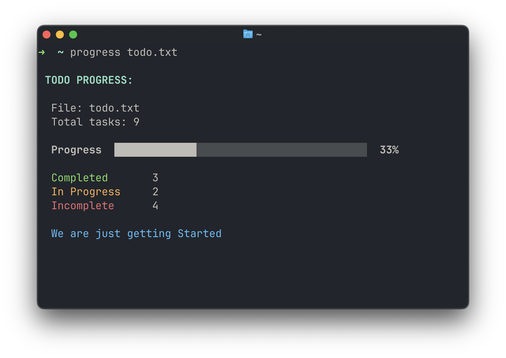

# progress-cli

A CLI that analyzes checklist and displays task completion progress.



It scans your file for:

- `[ ]` — incomplete tasks
- `[*]` — tasks in progress
- `[x]` / `[X]` — completed tasks

calculates overall completion percentage and displays a terminal progress bar.

## Features

- Fast single-pass checklist parsing
- Supports `[ ]`, `[*]`, `[x]`, and `[X]`
- Colored terminal output
- Progress percentage
- Completion statistics
- Helpful CLI errors
- `--help` and `--version` support
- No external dependencies

## Example

Given a file like:

```text
# todo list

- [x] do her
  [x] make a cli
- [x] writing a blog
- [*] go for groceries shopping
- [ ] learn Rust without crying
- [ ] practice not saying 'i use neovim btw'
- [x] Blame Java
- [*] Ask "what could possibly go wrong?"
- [ ] Find out what could possibly go wrong```

### Run:

```bash
progress todo.txt
```

Output:

```text
TODO PROGRESS

  File: todo.txt
  Total tasks: 9

  Progress  [██████████████████████░░░░░░░░░░░░░░░░] 55%

  Completed       5
  In Progress     2
  Incomplete      2

  More than halfway there.
```

## Installation

### Clone the repository

```bash
git clone https://github.com/thearkabanerjee/progress-cli.git
cd progress-cli
```

### Install the command

```bash
mkdir -p ~/bin
cp progress ~/bin/progress
chmod +x ~/bin/progress
```

Make sure `~/bin` is in your `PATH`:

```bash
echo 'export PATH="$HOME/bin:$PATH"' >> ~/.zshrc
source ~/.zshrc
```

You can now run:

```bash
progress todo.txt
```

## Usage

```text
progress <file>
```

### Options

```text
-h, --help       Show help
-v, --version    Show version
```

### Examples

```bash
progress todo.txt
```

```bash
progress notes.md
```

```bash
progress --help
```

```bash
progress --version
```

## How Progress Is Calculated

The completion percentage is calculated as:

```text
completed tasks
──────────────── × 100
total tasks
```

For example:

```text
Completed: 7
In Progress: 2
Incomplete: 1
Total: 10

Progress: 70%
```

Only completed tasks (`[x]` and `[X]`) contribute to the completion percentage.

## Requirements

- macOS, Linux, or another Unix-like operating system
- Bash
- `awk`
- `tr`

No additional packages or libraries are required.

## Development

Clone the repository:

```bash
git clone https://github.com/arkaspeaks/progress-cli.git
cd progress-cli
```

Make the script executable:

```bash
chmod +x progress
```

Run it directly:

```bash
./progress todo.txt
```

### Check for syntax errors

```bash
bash -n progress
```

### ShellCheck

If you have ShellCheck installed:

```bash
shellcheck progress
```

## Project Structure

```text
progress-cli/
├── progress       # Main CLI program
├── README.md      # Documentation
├── LICENSE        # Project license
└── .gitignore     # Git ignore rules
```

## Roadmap

Possible future improvements:

- [ ] Custom progress-bar width
- [ ] JSON output
- [ ] Quiet mode
- [ ] Strict checklist parsing
- [ ] Per-section progress
- [ ] Task filtering
- [ ] Config file
- [ ] Interactive TUI mode

## Contributing

Contributions, bug reports, and feature requests are welcome.

1. Fork the repository
2. Create a feature branch
3. Make your changes
4. Test the CLI
5. Open a pull request

## License

MIT License. See [LICENSE](LICENSE) for details.
